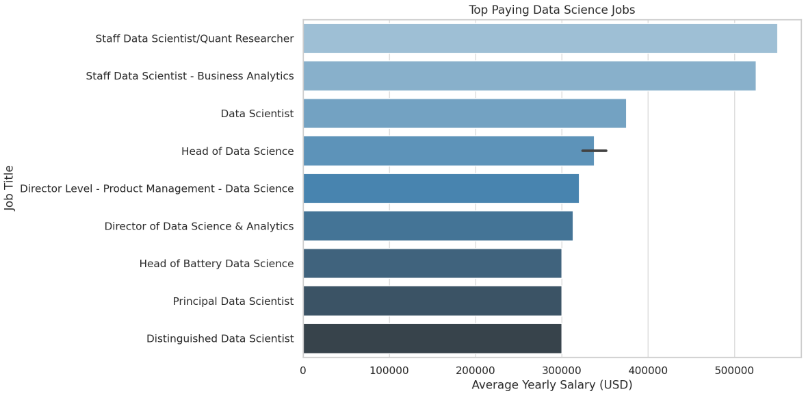
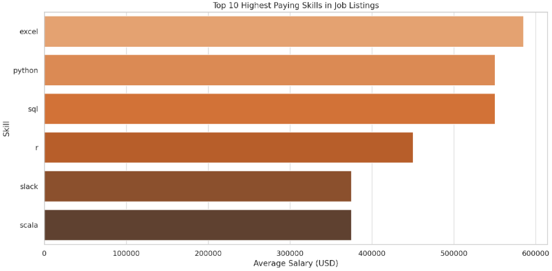
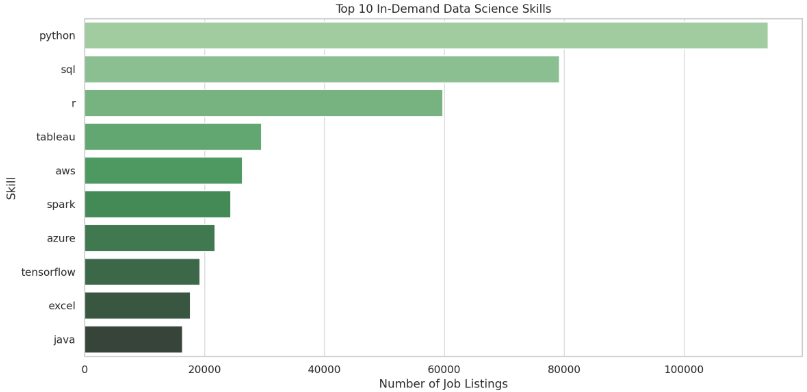
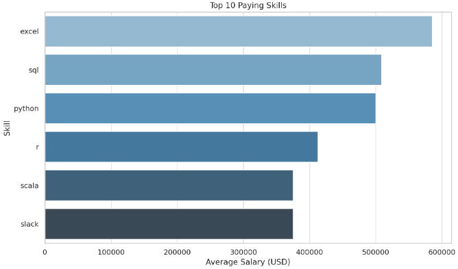
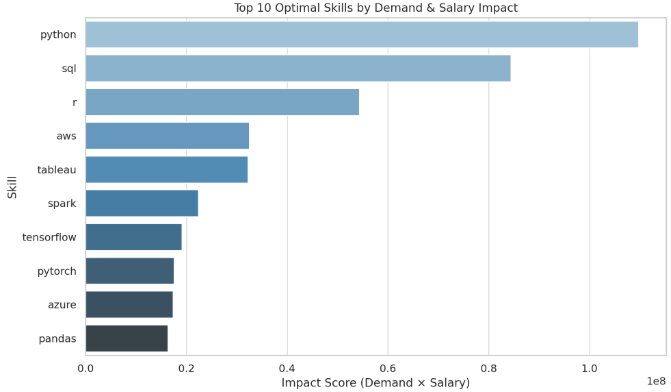

# Introduction
📊 This project analyzes job postings to identify the most in-demand skills and their associated salaries for remote Data Scientist roles. By combining skill frequency with average salary data, the goal is to highlight which technical skills are both popular and well-compensated in the current remote job market.

🔍 Check out the SQL queries used in this analysis here : [project_sql folder](/project_sql/)
#   Background
With the rapid growth of remote work, Data Science roles have become increasingly accessible from anywhere in the world. This project explores a dataset of job postings to identify the most in-demand skills and the average salaries offered for remote Data Scientist positions. The goal is to provide insights for job seekers and help them understand which technical skills are both valuable and well-paid in the remote job market.
#   Tools I Used
- **🐘 PostgreSQL:** 
     PostgreSQL served as the core database engine for executing SQL queries and performing complex data analysis. Its robust support for window functions, joins, and CTEs (Common Table Expressions) made it ideal for exploring relationships between job postings, companies, and technical skills.

- **💻 Visual Studio Code (VS Code)**
    VS Code was the primary development environment used to write, organize, and manage SQL scripts and documentation. With extensions like SQL syntax highlighting and Git integration, it helped streamline the workflow and keep code clean and readable.

- **🔧 Git**
    Git was used for version control, allowing me to track changes to SQL scripts and documentation over time. This made it easy to experiment, revert mistakes, and maintain a clean history of development.

- **🌐 GitHub**
    GitHub was used to host the project, collaborate, and share the analysis publicly. It also acts as a central place for documentation and source code, making the project easy to access and present as part of a data portfolio.
#   The Analysis
Each query has been aimed at investigating specific aspects of the Data Science job market.
Here's how i approached it: 
### 1. Top Paying Jobs
To identify the top paying remote jobs i filtered out the Data Scientist roles, Location to remote i.e. Anywhere and made sure that the salary is mentioned and not null. Highlighting the high paying opportunies available for Data Scientists. 
```sql
    SELECT 
        job_id,
        name AS company_name,
        job_title,
        job_via,
        job_location,
        salary_year_avg,
        job_posted_date::DATE
    FROM
        job_postings_fact 
    LEFT JOIN company_dim AS companies ON job_postings_fact.company_id = companies.company_id
    WHERE
        job_title_short = 'Data Scientist' AND
        job_location = 'Anywhere' AND  
        salary_year_avg IS NOT NULL
    ORDER BY
        salary_year_avg DESC
    LIMIT 10;
 ```
 **Here's the breakdown of top 10 highest paying Data Scientist Jobs:**
 
- Selby Jennings dominates the top-paying roles with salaries reaching up to $550,000/year for senior positions like Quant Researcher.

- Most high-paying positions are remote or listed as “Anywhere.”

- Roles like Head of Data Science and Senior Data Scientist are prevalent among the top jobs. 


*Graph Visualization for top 10 Data Science salaries, Generated using ChatGPT from my SQL query results.*
 ### 2. Top Paying Job Skills
 This query effectively highlights the top 10 highest-paying remote Data Scientist roles along with the skills needed for each. It's a great way to understand which companies are offering the best compensation and what skills you should focus on to qualify for those roles.
```sql
 WITH top_paying_jobs AS(
    SELECT 
        job_id,
        name AS company_name,
        job_title,
        job_via,
        salary_year_avg
    FROM
        job_postings_fact
    LEFT JOIN company_dim AS companies ON job_postings_fact.company_id = companies.company_id
    WHERE
        job_title_short = 'Data Scientist' AND
        job_location = 'Anywhere' AND  
        salary_year_avg IS NOT NULL
    ORDER BY
        salary_year_avg DESC
    LIMIT 10
)
SELECT 
    top_paying_jobs.*,
    skills
FROM 
    top_paying_jobs 
INNER JOIN skills_job_dim ON top_paying_jobs.job_id = skills_job_dim.job_id
INNER JOIN skills_dim AS skills ON skills_job_dim.skill_id = skills.skill_id
ORDER BY 
    salary_year_avg DESC;
```
**Here's the breakdown of highest paying job skills:**

- Surprisingly, Excel shows up at the top of the list with an average salary of $585,000, likely skewed by niche or executive-level roles.

- Python and SQL are again near the top, affirming their dual status as high-paying and high-demand.

- Other lucrative skills include R, Spark, and Hadoop—technologies common in big data and analytics roles.

*Graph Visualization for top 10 Data Science Skills of highest paying jobs, Generated using ChatGPT from my SQL query results.*
### 3. Top Demand Skills
To identify the top 10 most in-demand skills specifically for Data Scientist roles. I filtered the Data Scientist roles using CTEs, and then used Joins to connect the different tables on a common value. It helps identify which technical skills are most valuable and commonly expected by employers in this field.
```sql
WITH job_postings AS (
    SELECT 
    job_id,
    job_work_from_home,
    job_title_short
FROM
    job_postings_fact
WHERE 
    job_title_short = 'Data Scientist' 
)
SELECT
    skill_name.skill_id,
     skill_name.skills,
    COUNT(*) AS skill_count
FROM 
    job_postings
INNER JOIN skills_job_dim AS skillID ON job_postings.job_id = skillID.job_id
INNER JOIN skills_dim AS skill_name ON skillID.skill_id = skill_name.skill_id
GROUP BY
    skill_name.skill_id,
    skill_name.skills
    ORDER BY
    skill_count DESC
LIMIT 10;
```
**Here's the insights gained from this:**

- Python and SQL are must-haves for nearly any Data Scientist role, forming the foundation of technical skillsets.

- Visualization tools (Tableau, Power BI) are in high demand, showing the need to communicate insights effectively.

- Cloud and big data skills (AWS, Spark, Hadoop) are increasingly valued as companies scale their data operations.

- Excel’s presence shows that not all tasks require advanced tools—sometimes simplicity is key.

- Machine Learning knowledge is important, as shown by the inclusion of libraries like Scikit-learn.


*Graph Visualization for top 10 In-Demand Data Science Skills, Generated using ChatGPT from my SQL query results.*

### 4. Top Paying Skills
To understand which skills are linked to higher salaries in Data Scientist roles, I filtered job postings specifically for Data Scientist titles and ensured that only entries with salary information were included. Then, I joined the skills tables to match each job with its required skills. By grouping the data by job title and skill, I was able to calculate the average salary per skill. Finally, I sorted the results by average salary to highlight the top 10 highest-paying skills.
```sql
SELECT
    job_title,
    skills,
    ROUND(AVG(salary_year_avg), 0) AS avg_salary
FROM
    job_postings_fact
INNER JOIN skills_job_dim AS skill ON job_postings_fact.job_id = skill.job_id
INNER JOIN skills_dim AS skills_d ON skill.skill_id = skills_d.skill_id
WHERE
    job_title_short = 'Data Scientist' AND
    salary_year_avg IS NOT NULL
GROUP BY 
    job_title,
    skills
ORDER BY
    avg_salary DESC
LIMIT 10;
```
**Here's Breakdown of what we gained from this:**
- Big Data & Cloud skills (Spark, Hadoop, AWS) are not just in demand—they’re highly paid. These are key to handling large-scale production-grade data systems.

- Deep Learning frameworks (PyTorch, TensorFlow) lead to higher-paying roles, especially in AI and R&D domains.

- DevOps/DataOps tools (Airflow, Kubernetes) are gaining importance, signaling that MLOps skills are a differentiator in higher salary brackets.

- Excel and R, although more traditional tools, still command top salaries in specialized fields like finance, statistics, and healthcare analytics.


*Graph Visualization for top 10 Highest Paying Data Science Skills, Generated using ChatGPT from my SQL query results.*
### 5. Optimal Skills
In this query, I focused on remote Data Scientist jobs that include salary details. I then found out how often each skill appears (to see which are most in demand) and also calculated the average salary for jobs requiring each skill. After that, I filtered out skills that appeared in fewer than 20 job postings to keep the results meaningful. Finally, I sorted the list by demand to highlight the most useful and best-paying skills.
```sql
WITH skills_demand AS (
    SELECT
        skills_dim.skill_id,
        skills_dim.skills,
        COUNT(*) AS demand_count
    FROM 
        job_postings_fact
    INNER JOIN skills_job_dim ON job_postings_fact.job_id = skills_job_dim.job_id
    INNER JOIN skills_dim ON skills_job_dim.skill_id = skills_dim.skill_id
    WHERE
        job_title_short = 'Data Scientist' AND
        salary_year_avg IS NOT NULL AND
        job_work_from_home IS TRUE
    GROUP BY
        skills_dim.skill_id,
        skills_dim.skills
), 
average_salary AS (
    SELECT
        skills_dim.skill_id,
        skills_dim.skills,
        ROUND(AVG(job_postings_fact.salary_year_avg), 0) AS avg_salary
    FROM
        job_postings_fact
    INNER JOIN skills_job_dim ON job_postings_fact.job_id = skills_job_dim.job_id
    INNER JOIN skills_dim  ON skills_job_dim.skill_id = skills_dim.skill_id
    WHERE
        job_title_short = 'Data Scientist' AND
        salary_year_avg IS NOT NULL AND
        job_work_from_home IS TRUE
    GROUP BY 
       skills_dim.skill_id,
        skills_dim.skills
)
SELECT
    skills_demand.skill_id,
    skills_demand.skills,
    skills_demand.demand_count,
    avg_salary
FROM    
    skills_demand
INNER JOIN average_salary ON skills_demand.skill_id = average_salary.skill_id
WHERE 
    demand_count > 20
ORDER BY
    demand_count DESC;
```
**Insights gained from this are:**
- SQL and Python top the list as the most balanced skills — they are both highly in-demand and offer competitive salaries, making them essential for aspiring Data Scientists.

- Excel and Tableau appear frequently, showing that data visualization and analysis tools are still very relevant in remote data roles.

- R and TensorFlow show up less frequently but are linked to niche roles that can still pay well, especially in research or AI-heavy positions.


*Graph Visualization for Optimal Data Science Skills, Generated using ChatGPT from my SQL query results.*
#   What I Learned
Throughout this adventure, I've turbocharged my SQL toolkit with some serious firepower:

- 🧩 Complex Query Crafting: Mastered the art of advanced SQL, merging tables like a pro and wielding WITH clauses for ninja-level temp table maneuvers.
- 📊 Data Aggregation: Got cozy with GROUP BY and turned aggregate functions like COUNT() and AVG() into my data-summarizing sidekicks.
- 💡 Analytical Wizardry: Leveled up my real-world puzzle-solving skills, turning questions into actionable, insightful SQL queries
#   Conclusion